# Cours 

## Table des matières
- [Cours](#cours)
  - [Table des matières](#table-des-matières)
  - [Sujet et stack technique](#sujet-et-stack-technique)
  - [Docker command](#docker-command)
  - [Collection PostMan](#collection-postman)
  - [Grafana](#grafana)
  - [Endpoints utiles](#endpoints-utiles)
  - [Metrics (Prometheus + Grafana)](#metrics-prometheus--grafana)
    - [PromQL – exemples utiles (Prometheus et Grafana)](#promql--exemples-utiles-prometheus-et-grafana)
    - [Idées de panneaux Grafana](#idées-de-panneaux-grafana)
    - [Dépannage rapide](#dépannage-rapide)
  - [Base de données – seed (optionnel)](#base-de-données--seed-optionnel)
  - [Ports](#ports)
  - [Link](#link)
  - [DotNet](#dotnet)
  - [Database](#database)
  - [Diagram](#diagram)

## Sujet et stack technique
Ce projet est une API PokeDex pédagogique qui expose des endpoints sécurisés pour gérer espèces, types, attaques, médias, équipes et un service météo pour bonus/malus.

- Langage et framework: ASP.NET Core 9 (Web API)
- Authentification: IdentityCore (sans rôles) + JWT Bearer
- Base de données: PostgreSQL (EF Core 9, Npgsql), migrations automatiques au démarrage
- Documentation: Swagger/OpenAPI via NSwag
- Intégrations:
    - Service météo (Open‑Meteo) + cache (Redis) avec décorateur IDistributedCache
    - Observabilité: prometheus-net pour métriques /metrics, Prometheus pour scrape, Grafana pour dashboards
- Conteneurs: Docker/Docker Compose (API, Postgres, Redis, Prometheus, Grafana)

Objectifs pédagogiques:
- Corriger et unifier le DbContext et les mappings EF/Postgres
- Sécuriser l’API (JWT) et exposer une doc Swagger exploitable
- Ajouter un service externe (météo) et le mettre en cache
- Mettre en place l’observabilité (métriques, scrape, dashboard)

## Docker command

 - Create container with PostgreSQL image 
`docker run --name postgres-db -e POSTGRES_PASSWORD={PASSWORD} -e POSTGRES_USER={USER} -e POSTGRES_DB={DATABASE} -p 5432:5432 -v postgres-data:/var/lib/postgresql/data -d postgres`

 - Show all containers running
`docker ps`

 - Create the volume 
`docker volume create postgres-data`

 - Inspect the wolume
`docker volume inspect postgres-data`

 - Create a custom Image with dotnet and API program
` docker build -f .\BourgPalette\Dockerfile -t bourgpalette:latest .`

 - Create a container with the custom Image
` docker run --rm -p 8080:8080 -e "Swagger__Enabled=true" --name bourgpalette bourgpalette:latest`

 - Down Docker-Compose
` docker compose down -v`

  - Up and Build Docker-Compose
`docker compose up --build`

   - Environment required for Docker (placed in `.env` at repo root):
  ```
  POSTGRES_USER={USER}
  POSTGRES_PASSWORD={PASSWORD}
  POSTGRES_DB={DATABASE}
  # JWT secret used by the API (use a strong random value in prod)
  JWT__secret={dev-super-secret-change-me}
  ```

## Collection PostMan
Copier et coller l'URL du JSON dans l'importation de PostMan


## Grafana
 - Pour mettre à jour le mot de passe \
`docker exec -ti {grafana_container_name} grafana-cli admin reset-admin-password {new_password}`

## Endpoints utiles
- `GET /` → message de bienvenue
- `GET /health` → vérifie la DB
- `GET /dbinfo` → info EF/DB
- `GET /metrics` → endpoint Prometheus
- `GET /swagger` → Swagger UI

Auth:
- `POST /api/Auth/signup`, `/login`, `/token/refresh`, `/token/revoke`

Métier (JWT requis):
- `api/species`, `api/types`, `api/abilities`, `api/moves`, `api/media`, `api/teams`, `api/pokedex`
- Météo: `api/weather/...` (coords ou ville)

## Metrics (Prometheus + Grafana)

L'API expose des métriques Prometheus via `prometheus-net`.

- Endpoint métriques: `http://localhost:8080/metrics`
- Prometheus scrape (déjà configuré): job `API` vers `api:8080` dans `prometheus.yml`
- Grafana: connectez la datasource à `http://prometheus:9090`

Métriques disponibles:
- Requêtes HTTP ASP.NET Core (automatique):
    - `http_requests_received_total{code,method,controller,action}`
    - `http_request_duration_seconds_bucket{le,code,method,controller,action}` (+ `_sum`, `_count`)
- Processus et .NET (automatique): `process_*`, `dotnet_*`
- Météo (custom):
    - `weather_external_requests_total{outcome="ok|error"}`
    - `weather_external_request_duration_seconds_bucket{le}` (+ `_sum`, `_count`)
    - `weather_last_result_count`
    - `weather_cache_gets_total{result="hit|miss|error"}`
    - `weather_cache_sets_total{result="ok|error"}`
    - `weather_cache_last_ttl_seconds`

Notes:
- Le job `PSQL` dans `prometheus.yml` ne collecte rien par défaut (Postgres n'expose pas de métriques). Utilisez un exporter (p. ex. `prometheuscommunity/postgres-exporter`) et scrappez cet exporter.

### PromQL – exemples utiles (Prometheus et Grafana)

- Débit global (RPS) de l'API:
    - `sum(rate(http_requests_received_total[5m]))`

- RPS par endpoint (selon labels disponibles):
    - `sum(rate(http_requests_received_total[5m])) by (controller,action)`

- Taux d'erreur (non-2xx):
    - `sum(rate(http_requests_received_total{code!~"2.."}[5m]))`

- P95 latence globale (s):
    - `histogram_quantile(0.95, sum(rate(http_request_duration_seconds_bucket[5m])) by (le))`

- P95 latence par endpoint:
    - `histogram_quantile(0.95, sum(rate(http_request_duration_seconds_bucket[5m])) by (le, controller, action))`

- CPU du processus API:
    - `rate(process_cpu_seconds_total[5m])`

- Mémoire RSS (octets):
    - `process_working_set_bytes`

- Appels sortants météo – taux et erreurs:
    - Taux: `sum(rate(weather_external_requests_total[5m])) by (outcome)`
    - Erreur (%): `100 * sum(rate(weather_external_requests_total{outcome="error"}[5m])) / sum(rate(weather_external_requests_total[5m]))`

- P95 latence API météo (s):
    - `histogram_quantile(0.95, sum(rate(weather_external_request_duration_seconds_bucket[5m])) by (le))`

- Cache météo – hit ratio:
    - `sum(rate(weather_cache_gets_total{result="hit"}[5m])) / sum(rate(weather_cache_gets_total[5m]))`

- TTL du dernier cache (s):
    - `weather_cache_last_ttl_seconds`

### Idées de panneaux Grafana

- Stat (unités: req/s): `sum(rate(http_requests_received_total[5m]))`
- Stat (%): Erreurs: `100 * sum(rate(http_requests_received_total{code!~"2.."}[5m])) / sum(rate(http_requests_received_total[5m]))`
- Graph (s): P95 latence globale: `histogram_quantile(0.95, sum(rate(http_request_duration_seconds_bucket[5m])) by (le))`
- Graph (stacked): RPS par endpoint: `sum(rate(http_requests_received_total[5m])) by (controller,action)`
- Barre/Donut: Hit/Miss cache: `sum(rate(weather_cache_gets_total[5m])) by (result)`
- Graph: P95 météo externe: `histogram_quantile(0.95, sum(rate(weather_external_request_duration_seconds_bucket[5m])) by (le))`

### Dépannage rapide

- `http://localhost:9090/targets` → vérifiez que `API` est `UP`.
- Grafana → Datasource Prometheus doit pointer vers `http://prometheus:9090` (pas `localhost`).
- Si le job `PSQL` est `DOWN`, ajoutez un exporter Postgres ou supprimez le job.

## Base de données – seed (optionnel)
Vérifiez le nom réel du conteneur PostgreSQL via `docker ps` (ex: `pokedex-pokedex-db-1`).

```
# Copie des scripts
docker cp .\docker_ressources\01-schema.sql pokedex-pokedex-db-1:/tmp/01-schema.sql
docker cp .\docker_ressources\02-seed.sql  pokedex-pokedex-db-1:/tmp/02-seed.sql

# Exécution
docker exec -i pokedex-pokedex-db-1 psql -U trainerUser -d pokedex -v ON_ERROR_STOP=1 -f /tmp/01-schema.sql
docker exec -i pokedex-pokedex-db-1 psql -U trainerUser -d pokedex -v ON_ERROR_STOP=1 -f /tmp/02-seed.sql
```

## Ports
- API: 8080
- Prometheus: 9090
- Grafana: 3000
- Redis: 6379

## Link


[Tutorial Docker PostgreSQL](https://www.datacamp.com/tutorial/postgresql-docker?dc_referrer=https%3A%2F%2Fwww.google.com%2F)

[Documentation Docker HealthCheck](https://docs.docker.com/reference/dockerfile/#healthcheck)

[Tutorial API DotNet](https://learn.microsoft.com/en-us/aspnet/core/tutorials/min-web-api?view=aspnetcore-9.0&tabs=visual-studio-code)

[Documentation EF Core](https://learn.microsoft.com/en-us/ef/core/get-started/overview/first-app?tabs=netcore-cli)

[Tutorial Prometheus + Grafana](https://signoz.io/guides/how-to-install-prometheus-and-grafana-on-docker/)

## DotNet

 - Run the file Program.cs
`dotnet run`

 - Build the file Program.cs
`dotnet build`

 - Migrate database 
`dotnet-ef migrations add {Name}`

 - Update database
`dotnet-ef database update`

 - Migrate the database with context
`dotnet-ef migrations add MergeUnifiedContext --project "c:\Users\gaeta\Desktop\PokeDex\BourgPalette" --startup-project "c:\Users\gaeta\Desktop\PokeDex\BourgPalette" --context BourgPalette.Data.ApplicationDbContext`

 - Update the database with context 
`dotnet-ef database update --project "c:\Users\gaeta\Desktop\PokeDex\BourgPalette" --startup-project "c:\Users\gaeta\Desktop\PokeDex\BourgPalette" --context BourgPalette.Data.ApplicationDbContext`

## Database 

 - Populate the Database 
`docker cp .\docker_ressources\01-schema.sql pokedex-pokedex-db-1:/tmp/01-schema.sql` \
`docker cp .\docker_ressources\01-schema.sql pokedex-pokedex-db-1:/tmp/02-seed.sql` \
`docker exec -i pokedex-pokedex-db-1 psql -U trainerUser -d pokedex -v ON_ERROR_STOP=1 -f /tmp/01-schema.sql` \
`docker exec -i pokedex-pokedex-db-1 psql -U trainerUser -d pokedex -v ON_ERROR_STOP=1 -f /tmp/02-seed.sql`


## Diagram

```mermaid
flowchart TD
    subgraph "Clients & Tools"
        direction TB
        Swagger["Swagger UI"]:::client
        Postman["Postman"]:::client
    end

    subgraph "API Container"
        direction TB
        Program["Program.cs"]:::service
        Middleware["ErrorHandlingMiddleware"]:::service
        AuthMiddleware["JWT Authentication"]:::service

        subgraph "Controllers"
            direction TB
            Abilities["AbilitiesController"]:::controller
            AuthC["AuthController"]:::controller
            CRUD["CRUDController"]:::controller
            Media["MediaController"]:::controller
            Moves["MovesController"]:::controller
            Species["SpeciesController"]:::controller
            Teams["TeamsController"]:::controller
            Types["TypesController"]:::controller
            WeatherC["WeatherController"]:::controller
        end

        subgraph "Services"
            direction TB
            IToken["ITokenService"]:::service
            WeatherSv["WeatherService"]:::service
            CachedWeather["CachedWeatherService"]:::service
            PokeImporter["PokeApiImporter"]:::service
        end

        subgraph "Data Layer"
            direction TB
            AppDb["ApplicationDbContext"]:::data
            DbSeeder["DbSeeder"]:::service
            DesignFactory["ApplicationDbContextFactory"]:::service
            Migrations["EF Core Migrations"]:::data
        end

        subgraph "Config & Metrics"
            direction TB
            AppSettings["appsettings.json"]:::config
            DevSettings["appsettings.Development.json"]:::config
            MetricsSetup["metrics.cs"]:::service
        end
    end

    subgraph "Database Container"
        direction TB
        Postgres["PostgreSQL"]:::db
    end

    subgraph "External Services"
        direction TB
        PokeAPI["PokeAPI"]:::external
        WeatherAPI["Weather API"]:::external
    end

    subgraph "Monitoring Stack"
        direction TB
        Prometheus["Prometheus"]:::monitor
        Grafana["Grafana"]:::monitor
    end

    Swagger -->|HTTP| Program
    Postman -->|HTTP| Program

    Program -->|uses| Middleware
    Middleware -->|auth pipeline| AuthMiddleware
    AuthMiddleware -->|dispatch| Abilities
    AuthMiddleware -->|dispatch| AuthC
    AuthMiddleware -->|dispatch| CRUD
    AuthMiddleware -->|dispatch| Media
    AuthMiddleware -->|dispatch| Moves
    AuthMiddleware -->|dispatch| Species
    AuthMiddleware -->|dispatch| Teams
    AuthMiddleware -->|dispatch| Types
    AuthMiddleware -->|dispatch| WeatherC

    Abilities -->|calls| IToken
    AuthC -->|calls| IToken
    CRUD -->|calls| AppDb
    Media -->|calls| PokeImporter
    Moves -->|calls| AppDb
    Species -->|calls| AppDb
    Teams -->|calls| AppDb
    Types -->|calls| AppDb
    WeatherC -->|calls| WeatherSv

    WeatherSv -->|HTTP GET| WeatherAPI
    WeatherC -->|calls| CachedWeather
    CachedWeather -->|uses| AppDb

    PokeImporter -->|HTTP GET| PokeAPI

    AppDb -->|SQL| Postgres
    DbSeeder -->|seed| Postgres
    Migrations -->|migrate| Postgres
    DesignFactory -->|creates| AppDb

    Program -->|exposes /metrics| MetricsSetup
    Prometheus -->|scrape /metrics| MetricsSetup
    Grafana -->|query| Prometheus

    %% Click Events
    click Program "https://github.com/gaesty/pokedex/blob/main/BourgPalette/Program.cs"
    click Abilities "https://github.com/gaesty/pokedex/blob/main/BourgPalette/Controllers/AbilitiesController.cs"
    click AuthC "https://github.com/gaesty/pokedex/blob/main/BourgPalette/Controllers/AuthController.cs"
    click CRUD "https://github.com/gaesty/pokedex/blob/main/BourgPalette/Controllers/CRUDController.cs"
    click Media "https://github.com/gaesty/pokedex/blob/main/BourgPalette/Controllers/MediaController.cs"
    click Moves "https://github.com/gaesty/pokedex/blob/main/BourgPalette/Controllers/MovesController.cs"
    click Species "https://github.com/gaesty/pokedex/blob/main/BourgPalette/Controllers/SpeciesController.cs"
    click Teams "https://github.com/gaesty/pokedex/blob/main/BourgPalette/Controllers/TeamsController.cs"
    click Types "https://github.com/gaesty/pokedex/blob/main/BourgPalette/Controllers/TypesController.cs"
    click WeatherC "https://github.com/gaesty/pokedex/blob/main/BourgPalette/Controllers/WeatherController.cs"
    click IToken "https://github.com/gaesty/pokedex/blob/main/BourgPalette/Services/ITokenService.cs"
    click WeatherSv "https://github.com/gaesty/pokedex/blob/main/BourgPalette/Services/WeatherService.cs"
    click CachedWeather "https://github.com/gaesty/pokedex/blob/main/BourgPalette/Services/CachedWeatherService.cs"
    click PokeImporter "https://github.com/gaesty/pokedex/blob/main/BourgPalette/Services/PokeApiImporter.cs"
    click AppDb "https://github.com/gaesty/pokedex/blob/main/BourgPalette/Data/ApplicationDbContext.cs"
    click DbSeeder "https://github.com/gaesty/pokedex/blob/main/BourgPalette/Data/DbSeeder.cs"
    click DesignFactory "https://github.com/gaesty/pokedex/blob/main/BourgPalette/Data/DesignTime/ApplicationDbContextFactory.cs"
    click Migrations "https://github.com/gaesty/pokedex/tree/main/BourgPalette/Migrations/"
    click MetricsSetup "https://github.com/gaesty/pokedex/blob/main/BourgPalette/metrics/metrics.cs"
    click AppSettings "https://github.com/gaesty/pokedex/blob/main/BourgPalette/appsettings.json"
    click DevSettings "https://github.com/gaesty/pokedex/blob/main/BourgPalette/appsettings.Development.json"
    click Postgres "https://github.com/gaesty/pokedex/blob/main/docker-compose.yml"
    click Prometheus "https://github.com/gaesty/pokedex/blob/main/prometheus.yml"
    click Grafana "https://github.com/gaesty/pokedex/blob/main/docker-compose.yml"
    click Swagger "https://github.com/gaesty/pokedex/blob/main/PokeDex API v1.postman_test_run.json"
    click Postman "https://github.com/gaesty/pokedex/blob/main/PokeDex API v1.postman_test_run.json"

    %% Styles
    classDef controller fill:#D0E8FF,stroke:#3399FF;
    classDef service fill:#E8F4D0,stroke:#66CC33;
    classDef data fill:#D0F0D8,stroke:#33CC66;
    classDef db fill:#D0FFD8,stroke:#33AA33,stroke-dasharray: 5 5;
    classDef external fill:#F0F0F0,stroke:#999999,stroke-dasharray: 2 2;
    classDef monitor fill:#FFE8A0,stroke:#FFAA33;
    classDef client fill:#E8D0FF,stroke:#AA33FF;
    classDef config fill:#FFF4D0,stroke:#CC9900;
```
