# Cours 

## Docker command

 - Create container with PostgreSQL image 
`docker run --name postgres-db -e POSTGRES_PASSWORD={PASSWORD} -e POSTGRES_USER={USER} -e POSTGRES_DB={DATABASE} -p 5432:5432 -v postgres-data:/var/lib/postgresql/data -d postgres`

 - Show all containers running
`docker ps`

 - Create the volume 
`docker volume create postgres-data`

 - Inspect the wolume
`docker volume inspect postgres-data`

 - Create a custom Image with dotnet and API program
` docker build -f .\BourgPalette\Dockerfile -t bourgpalette:latest .`

 - Create a container with the custom Image
` docker run --rm -p 8080:8080 -e "Swagger__Enabled=true" --name bourgpalette bourgpalette:latest`

 - Down Docker-Compose
` docker compose down -v`

  - Up and Build Docker-Compose
`docker compose up --build`

   - Environment required for Docker (placed in `.env` at repo root):
  ```
  POSTGRES_USER={USER}
  POSTGRES_PASSWORD={PASSWORD}
  POSTGRES_DB={DATABASE}
  # JWT secret used by the API (use a strong random value in prod)
  JWT__secret={dev-super-secret-change-me}
  ```

## Collection PostMan
Copier et coller l'URL du JSON dans l'importation de PostMan


## Grafana
 - Pour mettre à jour le mot de passe \
`docker exec -ti {grafana_container_name} grafana-cli admin reset-admin-password {new_password}`

## Link

[Tutorial Docker PostgreSQL](https://www.datacamp.com/tutorial/postgresql-docker?dc_referrer=https%3A%2F%2Fwww.google.com%2F)

[Documentation Docker HealthCheck](https://docs.docker.com/reference/dockerfile/#healthcheck)

[Tutorial API DotNet](https://learn.microsoft.com/en-us/aspnet/core/tutorials/min-web-api?view=aspnetcore-9.0&tabs=visual-studio-code)

[Documentation EF Core](https://learn.microsoft.com/en-us/ef/core/get-started/overview/first-app?tabs=netcore-cli)

[Tutorial Prometheus + Grafana](https://signoz.io/guides/how-to-install-prometheus-and-grafana-on-docker/)

## DotNet

 - Run the file Program.cs
`dotnet run`

 - Build the file Program.cs
`dotnet build`

 - Migrate database 
`dotnet-ef migrations add {Name}`

 - Update database
`dotnet-ef database update`

 - Migrate the database with context
`dotnet-ef migrations add MergeUnifiedContext --project "c:\Users\gaeta\Desktop\PokeDex\BourgPalette" --startup-project "c:\Users\gaeta\Desktop\PokeDex\BourgPalette" --context BourgPalette.Data.ApplicationDbContext`

 - Update the database with context 
`dotnet-ef database update --project "c:\Users\gaeta\Desktop\PokeDex\BourgPalette" --startup-project "c:\Users\gaeta\Desktop\PokeDex\BourgPalette" --context BourgPalette.Data.ApplicationDbContext`

## Database 

 - Populate the Database 
`docker cp .\docker_ressources\01-schema.sql pokedex-pokedex-db-1:/tmp/01-schema.sql` \
`docker cp .\docker_ressources\01-schema.sql pokedex-pokedex-db-1:/tmp/02-seed.sql` \
`docker exec -i pokedex-pokedex-db-1 psql -U trainerUser -d pokedex -v ON_ERROR_STOP=1 -f /tmp/01-schema.sql` \
`docker exec -i pokedex-pokedex-db-1 psql -U trainerUser -d pokedex -v ON_ERROR_STOP=1 -f /tmp/02-seed.sql`


## Diagram

```mermaid
flowchart TD
    %% Client/Test Tools
    subgraph "Client/Test Tools"
        Swagger["Swagger UI"]:::client
        Postman["Postman"]:::client
    end

    %% API Container
    subgraph "BourgPalette API Container"
        direction TB
        Program["Program.cs"]:::internal

        subgraph "Middleware Pipeline"
            ErrorHandling["ErrorHandlingMiddleware"]:::internal
            Authentication["Authentication & JWT"]:::internal
        end

        subgraph "Controllers Layer"
            AuthController["AuthController"]:::internal
            CRUDController["CRUDController"]:::internal
            AbilitiesController["AbilitiesController"]:::internal
            SpeciesController["SpeciesController"]:::internal
            MovesController["MovesController"]:::internal
            MediaController["MediaController"]:::internal
            TeamsController["TeamsController"]:::internal
            TypesController["TypesController"]:::internal
            WeatherController["WeatherController"]:::internal
        end

        subgraph "Services Layer"
            PokeApiImporter["PokeApiImporter"]:::internal
            WeatherService["WeatherService"]:::internal
            CachedWeatherService["CachedWeatherService"]:::internal
            ITokenService["ITokenService"]:::internal
        end

        subgraph "Data Layer"
            AppDbContext["ApplicationDbContext"]:::internal
            DbSeeder["DbSeeder"]:::internal
            Migrations["Migrations"]:::internal
        end

        Health["/health endpoint"]:::internal
        Metrics["/metrics endpoint"]:::internal
    end

    %% Database Container
    subgraph "Database Container"
        PostgreSQL["PostgreSQL"]:::database
    end

    %% External Services
    PokeAPI["PokeAPI"]:::external
    WeatherAPI["Weather API"]:::external

    %% Monitoring Stack
    subgraph "Monitoring"
        Prometheus["Prometheus"]:::monitor
        Grafana["Grafana"]:::monitor
    end

    %% Flows
    Swagger -->|HTTP REST| AuthController
    Postman -->|HTTP REST| AuthController

    Program --> ErrorHandling
    ErrorHandling --> Authentication
    Authentication --> AuthController

    AuthController -->|uses| ITokenService
    CRUDController -->|uses| PokeApiImporter
    SpeciesController -->|uses| PokeApiImporter
    WeatherController -->|uses| WeatherService
    ControllersLayer -->|calls| ServicesLayer

    PokeApiImporter -->|HTTP/REST| PokeAPI
    WeatherService -->|HTTP/REST| WeatherAPI

    ServicesLayer -->|DI| AppDbContext
    AppDbContext -->|EF Core SQL queries| PostgreSQL

    DbSeeder ---|dashed| PostgreSQL
    Migrations ---|dashed| PostgreSQL

    Prometheus -->|scrape /metrics| Metrics
    Grafana -->|queries| Prometheus

    Metrics --> Metrics
    Health --> Health

    %% Click Events
    click Program "https://github.com/gaesty/pokedex/blob/main/BourgPalette/Program.cs"
    click ErrorHandling "https://github.com/gaesty/pokedex/blob/main/BourgPalette/Middleware/ErrorHandlingMiddleware.cs"
    click AuthController "https://github.com/gaesty/pokedex/blob/main/BourgPalette/Controllers/AuthController.cs"
    click CRUDController "https://github.com/gaesty/pokedex/blob/main/BourgPalette/Controllers/CRUDController.cs"
    click AbilitiesController "https://github.com/gaesty/pokedex/blob/main/BourgPalette/Controllers/AbilitiesController.cs"
    click SpeciesController "https://github.com/gaesty/pokedex/blob/main/BourgPalette/Controllers/SpeciesController.cs"
    click MovesController "https://github.com/gaesty/pokedex/blob/main/BourgPalette/Controllers/MovesController.cs"
    click MediaController "https://github.com/gaesty/pokedex/blob/main/BourgPalette/Controllers/MediaController.cs"
    click TeamsController "https://github.com/gaesty/pokedex/blob/main/BourgPalette/Controllers/TeamsController.cs"
    click TypesController "https://github.com/gaesty/pokedex/blob/main/BourgPalette/Controllers/TypesController.cs"
    click WeatherController "https://github.com/gaesty/pokedex/blob/main/BourgPalette/Controllers/WeatherController.cs"
    click PokeApiImporter "https://github.com/gaesty/pokedex/blob/main/BourgPalette/Services/PokeApiImporter.cs"
    click WeatherService "https://github.com/gaesty/pokedex/blob/main/BourgPalette/Services/WeatherService.cs"
    click CachedWeatherService "https://github.com/gaesty/pokedex/blob/main/BourgPalette/Services/CachedWeatherService.cs"
    click ITokenService "https://github.com/gaesty/pokedex/blob/main/BourgPalette/Services/ITokenService.cs"
    click AppDbContext "https://github.com/gaesty/pokedex/blob/main/BourgPalette/Data/ApplicationDbContext.cs"
    click DbSeeder "https://github.com/gaesty/pokedex/blob/main/BourgPalette/Data/DbSeeder.cs"
    click Migrations "https://github.com/gaesty/pokedex/tree/main/BourgPalette/Migrations"
    click Swagger "https://github.com/gaesty/pokedex/blob/main/swagger.json"
    click Postman "https://github.com/gaesty/pokedex/tree/main/Postman collection"
    click PostgreSQL "https://github.com/gaesty/pokedex/blob/main/docker-compose.yml"
    click Prometheus "https://github.com/gaesty/pokedex/blob/main/prometheus.yml"
    click Grafana "https://github.com/gaesty/pokedex/blob/main/docker-compose.yml"
    click Program "https://github.com/gaesty/pokedex/tree/main/Dockerfile"

    %% Styles
    classDef client fill:#D3D3F5,stroke:#6E6ED0,color:#000
    classDef internal fill:#E0F0FF,stroke:#3399FF,color:#000
    classDef database fill:#DFFFE0,stroke:#33CC33,color:#000
    classDef external fill:#F0F0F0,stroke:#AAAAAA,color:#000
    classDef monitor fill:#FFE5CC,stroke:#FF9933,color:#000

```
