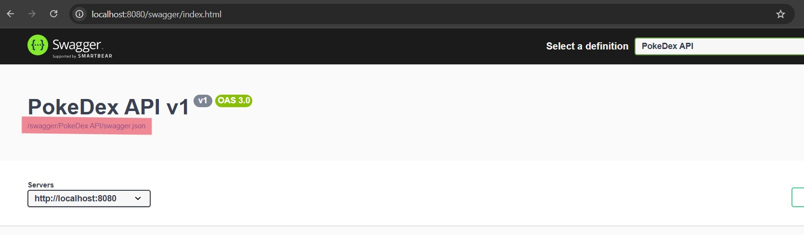
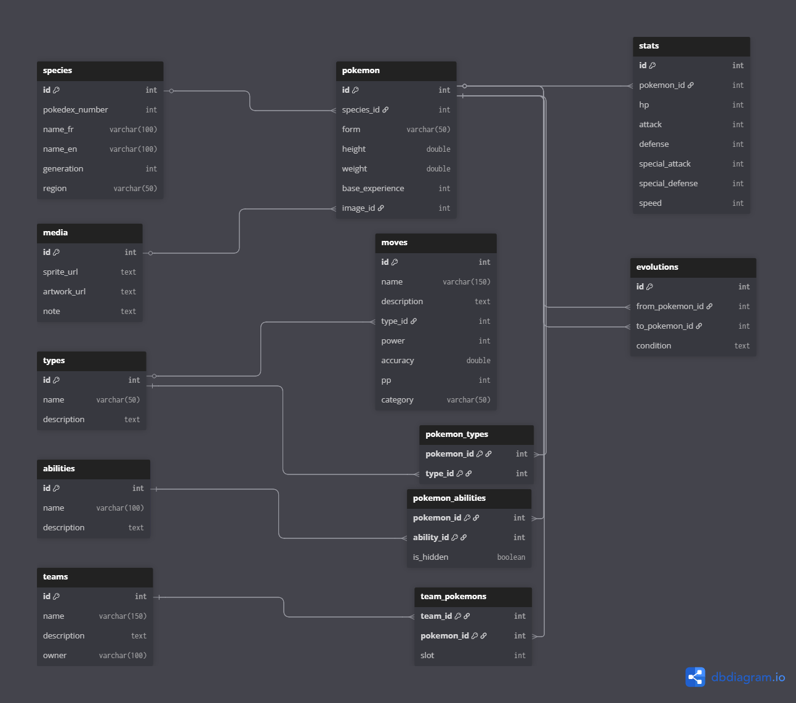

# Cours 

## Docker command

 - Create container with PostgreSQL image 
`docker run --name postgres-db -e POSTGRES_PASSWORD={PASSWORD} -e POSTGRES_USER={USER} -e POSTGRES_DB={DATABASE} -p 5432:5432 -v postgres-data:/var/lib/postgresql/data -d postgres`

 - Show all containers running
`docker ps`

 - Create the volume 
`docker volume create postgres-data`

 - Inspect the wolume
`docker volume inspect postgres-data`

 - Create a custom Image with dotnet and API program
` docker build -f .\BourgPalette\Dockerfile -t bourgpalette:latest .`

 - Create a container with the custom Image
` docker run --rm -p 8080:8080 -e "Swagger__Enabled=true" --name bourgpalette bourgpalette:latest`

 - Down Docker-Compose
` docker compose down -v`

  - Up and Build Docker-Compose
`docker compose up --build`

   - Environment required for Docker (placed in `.env` at repo root):
  ```
  POSTGRES_USER=trainerUser
  POSTGRES_PASSWORD=pokedexPassword
  POSTGRES_DB=pokedex
  # JWT secret used by the API (use a strong random value in prod)
  JWT__secret=dev-super-secret-change-me
  ```

## Collection PostMan
Copier et coller l'URL du JSON dans l'importation de PostMan



## Link

[Tutorial Docker PostgreSQL](https://www.datacamp.com/tutorial/postgresql-docker?dc_referrer=https%3A%2F%2Fwww.google.com%2F)

[Documentation Docker HealthCheck](https://docs.docker.com/reference/dockerfile/#healthcheck)

[Tutorial API DotNet](https://learn.microsoft.com/en-us/aspnet/core/tutorials/min-web-api?view=aspnetcore-9.0&tabs=visual-studio-code)

[Documentation EF Core](https://learn.microsoft.com/en-us/ef/core/get-started/overview/first-app?tabs=netcore-cli)

## DotNet

 - Run the file Program.cs
`dotnet run`

 - Build the file Program.cs
`dotnet build`

 - Migrate database 
`dotnet-ef migrations add {Name}`

 - Update database
`dotnet-ef database update`

 - Migrate the database with context
`dotnet-ef migrations add MergeUnifiedContext --project "c:\Users\gaeta\Desktop\PokeDex\BourgPalette" --startup-project "c:\Users\gaeta\Desktop\PokeDex\BourgPalette" --context BourgPalette.Data.ApplicationDbContext`

 - Update the database with context 
`dotnet-ef database update --project "c:\Users\gaeta\Desktop\PokeDex\BourgPalette" --startup-project "c:\Users\gaeta\Desktop\PokeDex\BourgPalette" --context BourgPalette.Data.ApplicationDbContext`

## Database 

 - Populate the Database 
`docker cp .\docker_ressources\01-schema.sql pokedex-pokedex-db-1:/tmp/01-schema.sql`
`docker cp .\docker_ressources\01-schema.sql pokedex-pokedex-db-1:/tmp/02-seed.sql`
`docker exec -i pokedex-pokedex-db-1 psql -U trainerUser -d pokedex -v ON_ERROR_STOP=1 -f /tmp/01-schema.sql`
`docker exec -i pokedex-pokedex-db-1 psql -U trainerUser -d pokedex -v ON_ERROR_STOP=1 -f /tmp/02-seed.sql`




<!-- ```
// Pokémon DB - schéma DBML généré d'après la diapositive

Table species {
  id int [pk, increment]            // Identifiant de l'espèce
  pokedex_number int
  name_fr varchar(100)
  name_en varchar(100)
  generation int
  region varchar(50)
}

Table media {
  id int [pk, increment]
  sprite_url text
  artwork_url text
  note text                         // champ libre pour préciser le type d'image si besoin
}

Table pokemon {
  id int [pk, increment]
  species_id int
  form varchar(50)                  // ex: Alola, forme shiny, etc.
  height double
  weight double
  base_experience int
  image_id int
}

Table types {
  id int [pk, increment]
  name varchar(50)
  description text
}

Table pokemon_types {
  pokemon_id int [pk]
  type_id int [pk]
}

Table abilities {
  id int [pk, increment]
  name varchar(100)
  description text
}

Table pokemon_abilities {
  pokemon_id int [pk]
  ability_id int [pk]
  is_hidden boolean                 // facultatif : talent caché
}

Table moves {
  id int [pk, increment]
  name varchar(150)
  description text
  type_id int
  power int                         // nullable si pas applicable
  accuracy double
  pp int
  category varchar(50)              // phys/spec/status (optionnel)
}

Table stats {
  id int [pk, increment]
  pokemon_id int
  hp int
  attack int
  defense int
  special_attack int
  special_defense int
  speed int
}

Table evolutions {
  id int [pk, increment]
  from_pokemon_id int
  to_pokemon_id int
  condition text                    // ex: "niveau 16", "Pierre d'éveil", "objet X"
}

Table teams {
  id int [pk, increment]
  name varchar(150)
  description text
  owner varchar(100)                // optionnel: user/owner
}

Table team_pokemons {
  team_id int [pk]
  pokemon_id int [pk]
  slot int                          // position dans l'équipe (optionnel)
}

/* Relations / Foreign keys */
Ref: pokemon.species_id > species.id
Ref: pokemon.image_id > media.id

Ref: pokemon_types.pokemon_id > pokemon.id
Ref: pokemon_types.type_id > types.id

Ref: pokemon_abilities.pokemon_id > pokemon.id
Ref: pokemon_abilities.ability_id > abilities.id

Ref: moves.type_id > types.id

Ref: stats.pokemon_id > pokemon.id

Ref: evolutions.from_pokemon_id > pokemon.id
Ref: evolutions.to_pokemon_id > pokemon.id

Ref: team_pokemons.team_id > teams.id
Ref: team_pokemons.pokemon_id > pokemon.id

``` -->

<!-- API .NET 9 sécurisée (JWT + Identity) pour gérer un Pokédex.
Flux d’authentification:
Signup (crée un utilisateur et rôle User si absent)
Login (retourne accessToken + refreshToken)
Refresh (renouvelle le couple de tokens)

Tous les endpoints métier exigent Authorization: Bearer {accessToken}.
Ressources principales (CRUD):
/api/pokedex (Pokémon + pagination + recherche)
/api/abilities
/api/moves
/api/media
/api/teams (+ gestion des membres: add/remove)
/health (diagnostic)
/dbinfo (infos techniques)

Modèle token:
accessToken: JWT court (Authorization)
refreshToken: chaîne persistée (table TokenInfos)

Étapes d’usage:
POST /api/auth/signup (une seule fois)
POST /api/auth/login → copier accessToken
Dans Postman: Auth type = Bearer Token
Appeler les endpoints CRUD
Lorsque 401/expired: POST /api/auth/token/refresh

Variables d’environnement suggérées:
baseUrl = http://localhost:8080
accessToken = (mis à jour après login)
refreshToken = (mis à jour après login)

Codes retour:
200 OK / 201 Created / 204 NoContent
400 Validation
401 Token manquant/invalide
404 Ressource absente
409 Conflit
500 Erreur interne (ProblemDetails)

Sécurité:
Changer JWT__secret en production
Révoquer/rotate refresh tokens si compromis


 -->